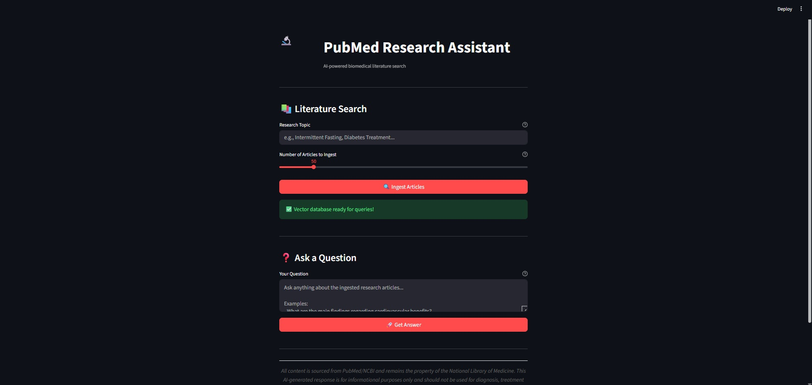
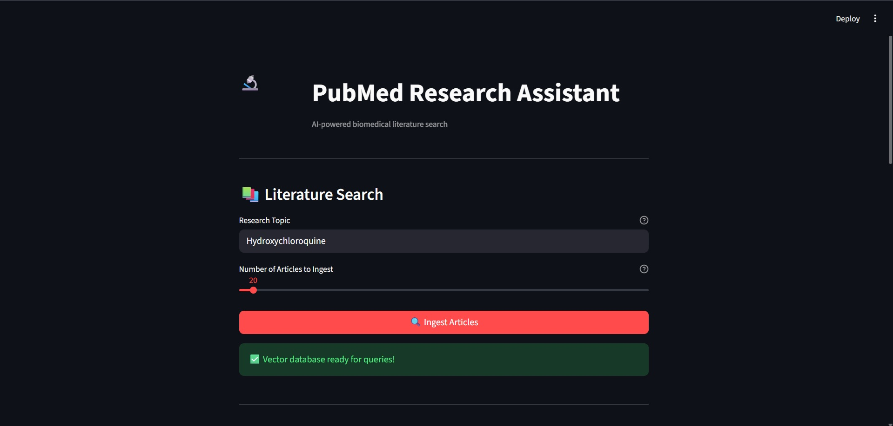
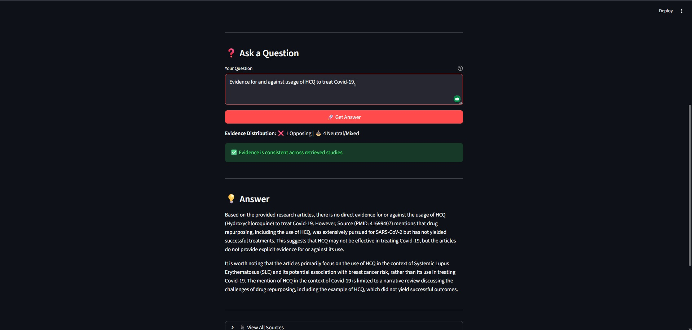
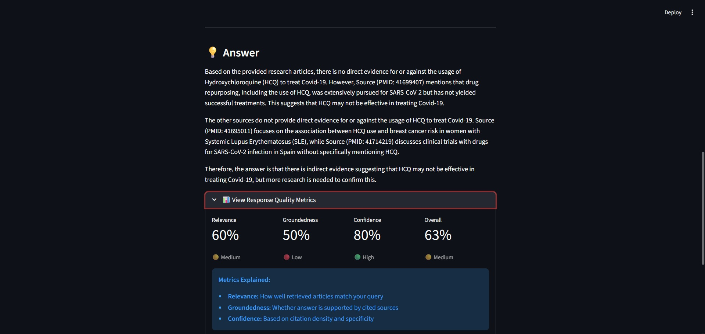
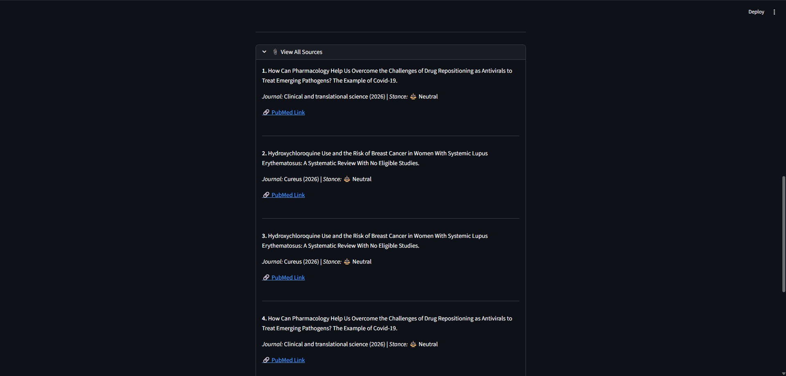
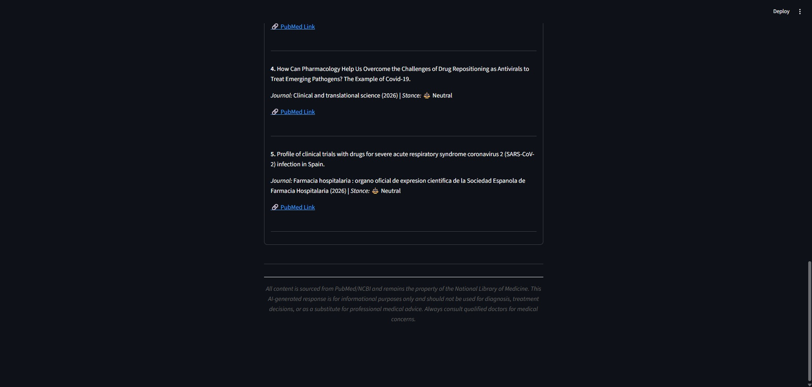
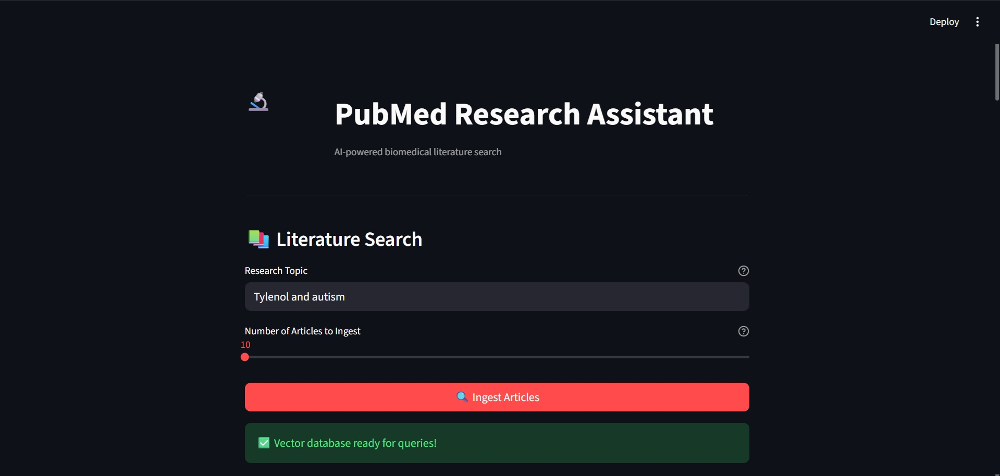
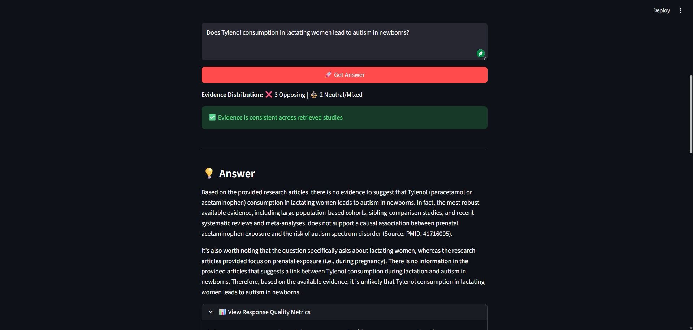
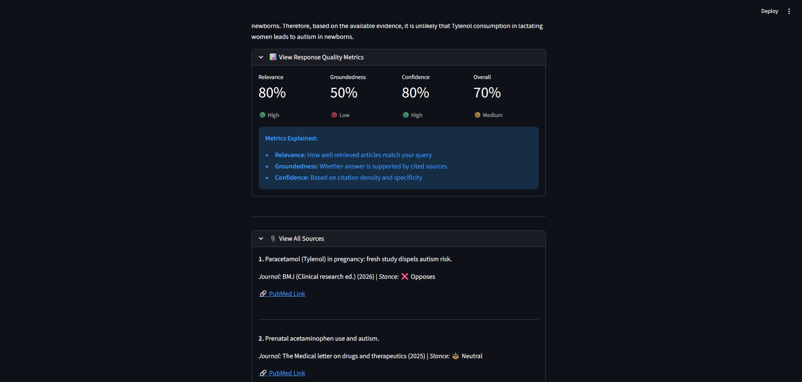

<p align="center">
  
</p>

<h2 align="center">🔬 MedTrace: Connecting the dots across PubMed</h2>
<p align="center"><b>RAG-powered biomedical literature analysis with contradiction detection and evidence synthesis.</b></p>

<p align="center">
  <a href="https://python.langchain.com/">
    
  </a>
  <a href="https://faiss.ai/">
    
  </a>
  <a href="https://groq.com/">
    
  </a>
  <a href="https://huggingface.co/">
    
  </a>
  <a href="https://streamlit.io/">
    
  </a>
  <a href="https://www.ncbi.nlm.nih.gov/pubmed/">
    
  </a>
</p>

<p align="center">
  
  
  
</p>

<p align="center">
  MedTrace retrieves, analyzes, and synthesizes peer-reviewed biomedical literature from PubMed, automatically detecting conflicting evidence and providing quality metrics for AI-generated responses.
</p>

---

## 📖 Description

### 🔹 What it does  
Connects to the PubMed database via NCBI E-utilities API to fetch peer-reviewed articles, chunks and embeds them into a FAISS vectorstore, then answers queries with automatically detected evidence contradictions and quality metrics.

### 🔹 What problem it solves  
Eliminates manual literature review burden while providing **critical analysis** of conflicting study findings—something standard RAG systems ignore. Users get not just answers, but insight into the strength and consistency of the underlying evidence.

### 🔹 Key Differentiators  
Unlike standard RAG systems that present retrieved text blindly, MedTrace:
- **Detects contradictions** across multiple studies and synthesizes conflicting evidence
- **Scores response quality** using LLM-as-judge evaluation (relevance, groundedness, confidence)
- **Surfaces evidence distribution** (Supporting/Opposing/Neutral) transparently

---

## ✨ Key Features

| Feature | Description |
|---------|-------------|
| **🔍 PubMed Integration** | Direct API access to 39M+ peer-reviewed biomedical articles |
| **⚡ Contradiction Detection** | LLM-based stance classification identifies conflicting study conclusions |
| **📊 Quality Metrics** | Real-time evaluation dashboard (Relevance, Groundedness, Confidence) |
| **🧠 Evidence Synthesis** | Automatic summarization of opposing viewpoints when contradictions detected |
| **🔗 Source Transparency** | Every claim linked to PubMed source with stance classification |

---

## 📂 Folder Structure

```bash
MedTrace/
├─ artifacts/
│  ├─ screenshots/           # UI screenshots and demo images
│  └─ *.txt                  # Documentation and reference files
│
├─ core/                     # Backend processing modules
│  ├─ __init__.py           # Package exports
│  ├─ config.py             # Environment configuration and path resolution
│  ├─ pubmed_fetcher.py     # NCBI E-utilities API integration for article retrieval
│  ├─ chunker.py            # Recursive character text splitting with overlap
│  ├─ embeddings.py         # SentenceTransformer wrapper with fallback mechanisms
│  ├─ vector_store.py       # FAISS index creation and persistence
│  ├─ query_engine.py       # Retrieval and LLM response generation
│  ├─ contradiction_detector.py  # Stance analysis and conflict detection
│  └─ evaluation.py         # LLM-as-judge metrics (relevance, groundedness)
│
├─ frontend/
│  └─ app.py                # Streamlit UI with real-time metrics dashboard
│
├─ .env                     # Environment variables (API keys, paths) - not committed
├─ .gitignore              # Git exclusion rules
├─ requirements.txt        # Python dependencies
└─ README.MD               # This file
```

> ⚠️ **Prerequisites:** Create a .env file in the root directory with:
> - `GROQ_API_KEY`  
> - `VECTOR_DIR`  
> - `GROQ_MODEL`  
> - `EMBEDDING_MODEL`  

## 🛠️ Setup Instructions

### 1️⃣ Clone the Repository

```bash
git clone https://github.com/inv-fourier-transform/med-trace.git
cd MedTrace
```

---

### 2️⃣ Create a Virtual Environment

```bash
python -m venv .venv
```

#### Activate the Virtual Environment

**Windows:**
```bash
.venv\Scripts\activate
```

**macOS/Linux:**
```bash
source .venv/bin/activate
```

---

### 3️⃣ Install Dependencies

```bash
pip install -r requirements.txt
```

---

### 4️⃣ Configure Environment Variables

Create a `.env` file in the project root and add your required API keys.

## ▶️ Execution

### Streamlit UI (Recommended)

```bash
streamlit run frontend/app.py
```

**Workflow:**

1. Enter a biomedical topic (e.g., `"ketogenic diet"`)
2. Select number of articles to ingest (10–299)
3. Click **"Ingest Articles"** to fetch, chunk, and embed
4. Ask questions and view contradiction analysis with quality metrics

---

### CLI Mode

```bash
python main.py
```

---

## 🚀 The 2 New Features

### 1. ⚡ Contradiction Detection & Evidence Synthesis

Standard RAG systems retrieve documents without analyzing agreement. **MedTrace** adds LLM-based stance analysis:

- **Classifies stance:** Each study labeled as **Supporting**, **Opposing**, or **Neutral**
- **Detects conflicts:** Identifies when evidence contradicts (e.g., 3 studies show benefits, 2 show no effect)
- **Synthesizes conflicts:** Generates balanced explanation of contradictions (study design differences, populations, protocols)

## Screenshots

### 1. Streamlit Frontend Interface


### 2. Results
#### Topic 1: "Hydroxychloroquine"
#### Query: Evidence for and against the usage of HCQ for treatment of Covid-19







#### Topic 2: "Tylenol and autism"
#### Query: Does Tylenol consumption in lactating women lead to autism in newborns?






#### Example Output

```text
Evidence Distribution: ✅ 3 Supporting | ❌ 2 Opposing | ⚖️ 1 Neutral

⚠️ Contradictory Evidence Detected

Evidence Synthesis:
While three RCTs demonstrate cardiovascular benefits of intermittent fasting,
two recent meta-analyses found no significant effect when controlling for 
caloric deficit. Differences stem from intervention duration protocols.
```

---

## 🎥 Demo Video

[](artifacts/Video_Audio_Files/MedTrac_video_recording_compressed_twice.mp4)

*The demo video can be viewed by downloading it. It's just 14 MB in size!*

*FYI, Miss K, a metaphor for someone🤔, is endorsing my product!*

---

### 2. 📊 RAG Evaluation Metrics Dashboard

Every response includes **LLM-as-judge quality metrics:**

| Metric        | Description                                           |
|--------------|-------------------------------------------------------|
| Relevance     | Retrieved articles match the query specificity        |
| Groundedness  | Answer is factually supported by sources              |
| Confidence    | Citation density and specificity                      |
| Overall       | Aggregate quality score                               |

**Indicators:**  
🟢 High (≥80%) | 🟡 Medium (60–79%) | 🔴 Low (<60%)

---

## 🛠️ Technologies Used

- Python 3.10+ – Core language  
- LangChain – RAG orchestration  
- FAISS – Vector similarity search  
- Sentence-Transformers – BGE embeddings  
- Groq – High-speed LLM inference  
- Streamlit – Web interface  
- PubMed E-utilities API – Literature source  

---

## 🔮 Roadmap

- Multi-query Retrieval – Decompose complex questions into sub-queries  
- Citation Network Analysis – Map relationships between studies  
- Export Functionality – Generate PDF reports with citations  

---

## 🙏 Credits

- NLM/NCBI for PubMed database and E-utilities API  
- BAAI for BGE embedding models  
- LangChain and Streamlit communities  

---

## ⚠️ Disclaimer

Content sourced from PubMed/NLM. For informational purposes only — not for diagnosis or treatment decisions. Always consult healthcare providers for medical advice. Evidence metrics are algorithmic estimates and should not replace reading primary sources.

---

## 📌 Quick Tips

- **Specific queries work best** – Ask precise clinical questions  
- **Check evidence distribution** – Review Supporting/Opposing badges  
- **Monitor metrics** – Low groundedness indicates weak source support  

---

*MedTrace: Where AI meets evidence-based medicine.*